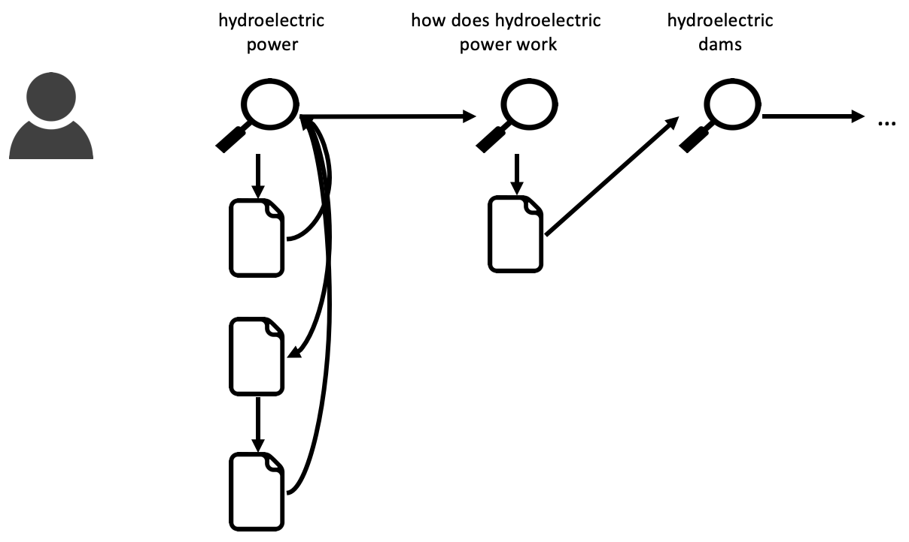
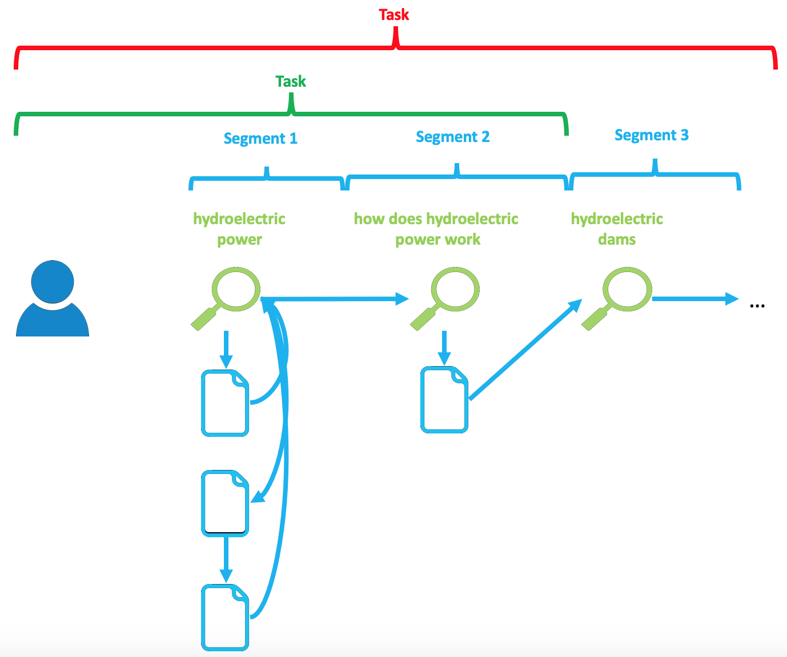
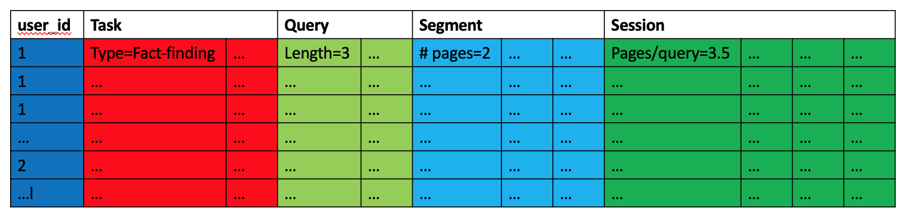

## Feature Extraction ##

Coagmento offers a one-stop Python script to help you extract browsing features for participants conducting search tasks. The script extracts...

## Interaction Patterns ##

The feature extraction script makes several assumptions about the interaction patterns a user conducts while browsing. It is assumed that the user issues one query at a time and browses pages before proceeding to the next query. Below is an example illustration of such an interaction.

More specifically, the following assumptions are made:

* The user issues one query at a time.
* After that query, the user navigates to any number of pages by clicking SERP results or URLs or by navigating back to the original query.
* During this time, the user does not switch between multiple queries.
* When the user issues a new query, that is the start of a query segment.

## Data and Features ##

## Running the Script ##

TBD