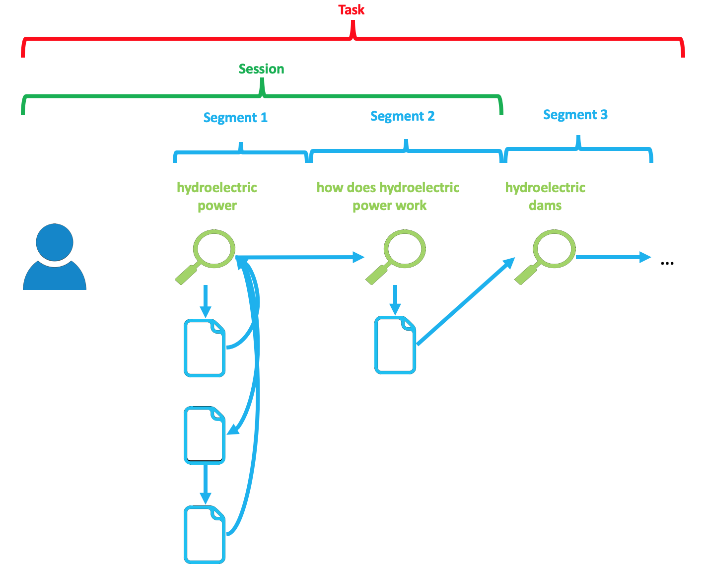

## Feature Extraction ##

Coagmento offers a one-stop Python script to help you extract browsing features for participants conducting your assigned search tasks. The script extracts browsing features for each query segment and exports them to a data frame that you can use for various statistical and machine learning tasks, for instance predicting the type of task from behavioral patterns.

The following document describes the patterns of interaction assumed by your users in order for this script to be accurate and effective. It also describes how to run the script and enumerates the extracted features and structure of the provided data frame.

## Interaction Patterns ##

For effective and accurate feature extraction, this script makes several assumptions about the interaction patterns a user conducts while browsing the Web. It is assumed that user interactions are broken up into discrete and non-overlapping "query segments". A "query segment" is defined as the query a user issues to a search engine and the subsequently viewed pages resulting from that query.  When the user issues a new query to a search engine, this begins a new query segment.

It is assumed that the user issues one query at a time and browses pages before proceeding to the next query. Below is an example illustration of such an interaction.

More specifically, the following assumptions are made:

* The user's first interaction begins with a query segment.
* The user issues one query at a time.
* After that query, the user navigates to any number of pages by clicking results on the search engine result page (SERP) or by navigating to URLs linked through these pages.
* During this time, the user does not switch between multiple queries.
* When the user issues a new query, the user starts a new query segment.
* (In other words, user interactions are separated into discrete, non-overlapping, non-repeated query segments.)

## Data and Features ##

The feature extraction script extracts several levels of features and outputs them into a data frame.  The levels of features can be broken up as follows.

* **Query (light green)** - Aspects about the query string issued to the search engine (e.g. query length).
* **Session (green)** - Session level features accumulated throughout the entire session (e.g. average query length).
* **Segment (light blue)** - Features accumulated within the current query segment (e.g. time spent on content pages in the segment).
* **Task (red)** - Features pertaining to the task, as defined by the researcher.
* **User (blue)** - Any user-specific features (e.g., demographic).

The script outputs results into a data frame, where each row is a query segment. The following features are extracted:

Query

* **segment_query_length** - Query length
* **segment_time_dwell_serp** - Segment dwell time on SERPs
* **segment_time_dwell_content** - Segment dwell time on content pages
* **segment_time_percent_dwell_serp** - % time on SERPs
* **segment_num_content_unique** - \# unique content pages visited

Whole session

* **session_num_content_unique** - \# unique content pages visited
* **session_num_queries** - \# queries
* **session_time_total** - completion time
* **session_time_dwell_serp** - Total dwell time on content pages
* **session_time_dwell_content** - Total dwell time on SERPs
* **session_percent_time_SERPs** - % time on SERPs

## Running the Script ##

## Features to Add ##

Generally speaking:

* Mouse clicks
* Mouse scrolls
* Mouse movements
* Bookmarks
* Support for more robust interaction patterns

Feel free to modify it as you wish for more robust interaction patterns.

## Suggestions? Contact Us! ##

Or post a feature request/issue.